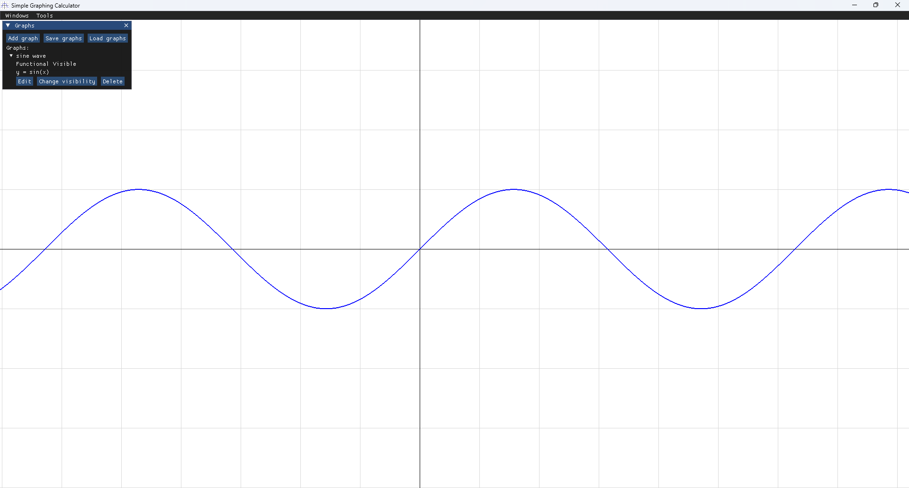
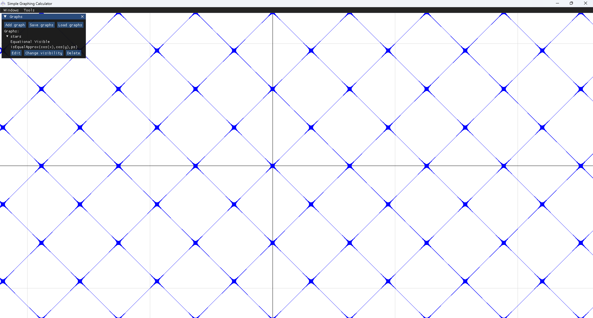

# Simple Graphing Calculator (SGC)

Visual GPU-driven graphing calculator made in c++ with OpenGL.

## Description

The rendering of the graph dependant only on gpu, with this approach
it doen't matter how complex the graph is or how far zoomed out are you.
Workload depends on pixel count and number of graphs.

Graphs with a lot of expensive operations still can lower performance,
because operations will be recalculated for every pixel every frame.

Example of simple and complex functions. (y = sin(x) and cos(x) = cos(y))

    
    

## Usage

Executable should be in the same directory as data folder.

When SGC is open would won't see any windows, you will need to open them
through headers first.

### Headers:

- windows (here you can find all the windows you can open)
- tools (tools and utils you might need)

### Windows:

- info window (get general info about SGC version, possition, zoom, etc.)
- graphs window (add, remove and edit graphs)

### Graphs

Graphs can be functional (default) or equational.

Functional work like this: \
if (y == graph_body) \
Graph body should return a float.

Equational work like this: \
if (graph_body) \
Graph body should return a bool.

**Constants:**
- x (world pos x)
- y (world pos y, for equations)
- ps (pixel size, for equations)
- pi (~3.14)
- t (elapsed time in seconds)

**Operations:**
- \+ - * / && || !

**Functions**
- pow(a,b)
- sin(a)
- cos(a)
- tan(a)
- cot(a)
- isEqualApprox(a,b,c)

### Saving graphs

Press save graphs and enter filename you want and all
graphs will be saved to the file.

Savefiles are at "./data/saves/"